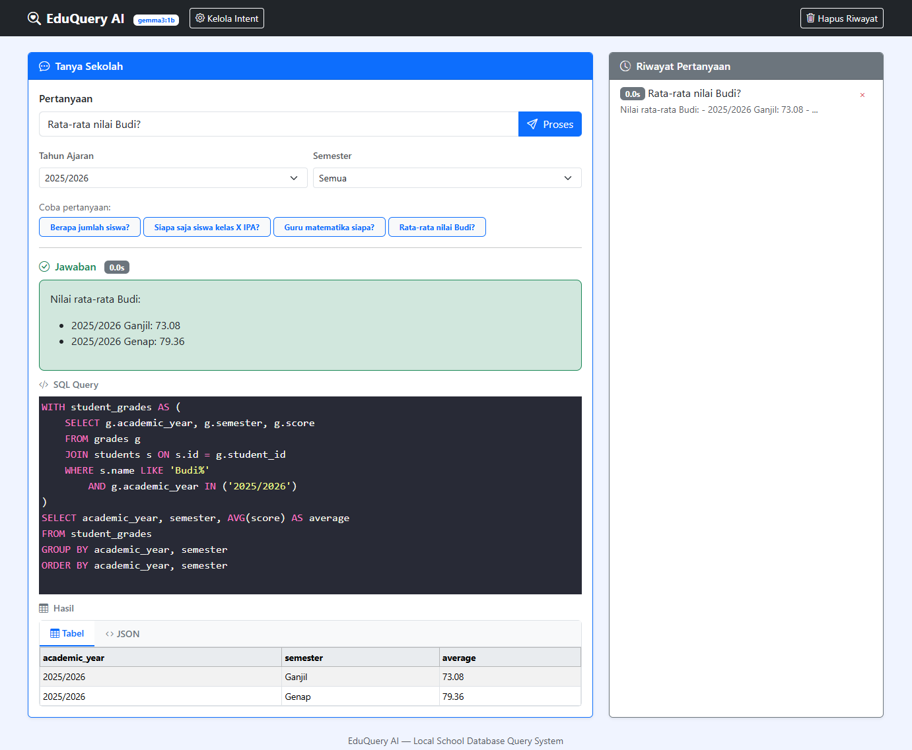

# EduQuery AI

EduQuery AI adalah sistem tanya-jawab database sekolah berbasis bahasa alami yang berjalan lokal. Dilengkapi antarmuka web dan endpoint API.

## Fitur

- **Intent-based SQL**: 30+ intent pertanyaan dengan template SQL menggunakan CTE
- **Keyword Classifier**: Deteksi intent cepat (tanpa LLM) untuk pertanyaan umum seperti jumlah siswa, rata-rata nilai, wali kelas
- **LLM Fallback**: Ollama (`gemma3:1b`) untuk pertanyaan kompleks yang tidak cocok keyword
- **Filter Tahun Ajaran & Semester**: Dropdown filter yang selalu muncul di SQL dengan `IN()` syntax
- **SSE Streaming**: Progress real-time saat memproses pertanyaan
- **Riwayat Pertanyaan**: Tersimpan di localStorage browser
- **Intent Management**: Halaman `/intents` untuk melihat/mengedit intent
- **Dual DB Support**: MySQL (Docker) atau SQLite (dev lokal)

## Quick Start

```bash
# Opsi 1 — Docker (recommended)
scripts/run.sh docker

# Opsi 2 — Lokal
scripts/run.sh init       # Pull model Ollama + migrasi DB
scripts/run.sh start      # FastAPI dev server di http://localhost:8000
```

### Container management

```bash
scripts/run.sh docker-init  # Jalankan ulang init (migrasi + pull model)
scripts/run.sh restart       # Restart app container
scripts/run.sh logs          # Tail app container logs
scripts/run.sh stop          # docker compose down
```

### Testing

```bash
scripts/run.sh test
```

## Antarmuka Web

Buka `http://localhost:8000` setelah server berjalan.



- Kotak teks untuk mengetik pertanyaan
- **Filter Tahun Ajaran & Semester** (dropdown, default "Semua")
- Tombol contoh pertanyaan cepat (reset filter ke Semua)
- Timer elapsed realtime selama loading
- Progress bar + step indicator (SSE streaming)
- Menampilkan SQL query yang dihasilkan, hasil mentah (tabel/JSON), dan balasan natural
- Riwayat pertanyaan tersimpan di localStorage (klik untuk menjalankan ulang)

## Endpoint API

### `POST /api/query`

Mengembalikan SQL, hasil mentah, balasan natural.

```json
{
  "message": "Berapa jumlah siswa kelas X IPA?",
  "academic_year": "Semua",
  "semester": "Semua"
}
```

### `GET /api/query/stream`

SSE endpoint dengan progress real-time (5 tahap: analisis → SQL → validasi → eksekusi → jawaban).

```
GET /api/query/stream?message=Rata-rata+nilai+Budi&academic_year=Semua&semester=Semua
```

### `GET /api/config`

Mengembalikan konfigurasi publik (model, daftar tahun ajaran, semester).

### `GET /api/intents`

Daftar intent, template SQL, contoh, dan parameter.

## Intent Reference

Daftar lengkap intent + SQL template ada di [`database/intents.md`](database/intents.md).
Intent dikelola secara dinamis melalui file `prompts/intents.json` dan dapat ditambah/diedit melalui halaman `/intents`.

## Environment Variables

Semua konfigurasi dikelola via `.env` (lihat `.env.example` untuk template):

| Variabel | Wajib | Default | Deskripsi |
|----------|-------|---------|-----------|
| `DB_HOST` | ✅ | `localhost` | Host database |
| `DB_PORT` | ✅ | `3306` | Port database |
| `DB_NAME` | ✅ | `db_eduquery` | Nama database |
| `DB_USER` | ✅ | `root` | User database |
| `DB_PASSWORD` | ✅ | — | Password database |
| `DB_IS_LOCAL` | | auto | Pakai SQLite (`true`) atau MySQL (`false`) |
| `OLLAMA_HOST` | ✅ | `http://localhost:11434` | URL Ollama API |
| `OLLAMA_MODEL` | | `gemma3:1b` | Model LLM |
| `OLLAMA_TIMEOUT` | | `60` | Timeout panggilan Ollama (detik) |
| `APP_HOST` | | `0.0.0.0` | Bind address FastAPI |
| `APP_PORT` | | `8000` | Port FastAPI |
| `SQLITE_PATH` | | `database/eduquery.db` | Path file SQLite (local dev) |
| `ACADEMIC_YEARS` | | `2023/2024,2024/2025,2025/2026` | Tahun ajaran untuk seed |
| `SEMESTERS` | | `Ganjil,Genap` | Semester |

## Project Structure

```
├── app/                          # Aplikasi FastAPI
│   ├── main.py                   # Entry point, serve static + API
│   ├── api/
│   │   ├── config.py             # GET /api/config
│   │   ├── intents.py            # GET /api/intents
│   │   └── query.py              # POST /api/query + GET /api/query/stream
│   ├── ai/
│   │   ├── intent_extractor.py   # Intent + slot extraction via Ollama
│   │   └── keyword_classifier.py # Deterministic keyword → intent (fast path)
│   ├── sql/
│   │   ├── template_engine.py    # Intent → SQL templates
│   │   └── validator.py          # SELECT-only validator
│   ├── database/
│   │   ├── client.py             # DB client (MySQL / SQLite)
│   │   ├── migrate.py            # Drop + create + seed (cohort-based)
│   │   └── schema_meta.py        # Schema metadata + column aliases
│   ├── formatter/response.py     # DB result → natural language
│   ├── services/                 # Service layer (intent, database, formatter)
│   └── core/config.py            # Semua konfigurasi dari .env
├── static/                       # Frontend (Bootstrap)
│   ├── index.html
│   ├── app.css
│   └── app.js
├── prompts/
│   └── intents.json              # 30 intent definitions with SQL templates
├── database/
│   └── intents.md                # Intent reference documentation
├── scripts/
│   ├── run.sh                    # Unified runner
│   ├── docker-init.sh            # Init container entrypoint
│   ├── init.sh                   # Legacy alias
│   └── start.sh                  # App container entrypoint
├── Dockerfile / docker-compose.yml
├── .env.example
└── pyproject.toml
```
